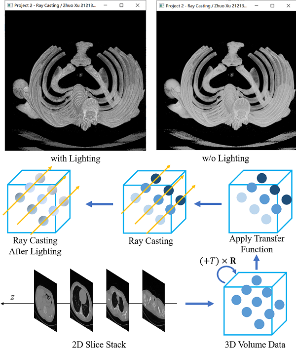
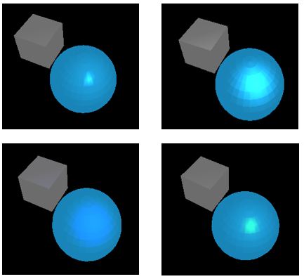

# seu-viz

This is the Lab Homework of 《信息可视化技术》（东南大学研究生课程）. It consists of 2 parts:

- Basic OpenGL Rendering of a Cube and a Sphere with Lighting and Observation
- Volume Rendering via Ray Casting

My solution runs on pure C++ and OpenGL, without difficult shader programing and CUDA or much 3rd-party libraries.

## 2-raycasting

Configurate `config.json` according to your volume data, and compile the solution with `2-raycasting` as boot project.



## 1-display

Compile the solution with `1-display` as boot project.



## Dependencies

It's 2021, I would recommend you to use [vcpkg](https://github.com/microsoft/vcpkg) to install C++ dependencies.

```powershell
vcpkg install glfw3 glad glm rapidjson
```

## Document

- [《信息可视化技术》课程实验报告与课程综述报告（212138-卓旭）.pdf](./doc/《信息可视化技术》课程实验报告与课程综述报告（212138-卓旭）.pdf) 
- [《信息可视化技术》课程报告勘误（212138-卓旭）.pdf](./doc/《信息可视化技术》课程报告勘误（212138-卓旭）.pdf)

## DO NOT COPY!

> **《东南大学学生学术道德规范条例》**
>
> 第九条 有下列行为之一的，应当被认定为违反学术道德的行为：
>
> 1、侵占、抄袭、剽窃他人学术成果（包括论文成果、技术报告、软件程序和研究数据及课程论文等）；

如果我的实验代码或报告对你有所帮助，欢迎你规范引用。对于任何违反学术道德规范的行为，将请各级学术委员会处理。

